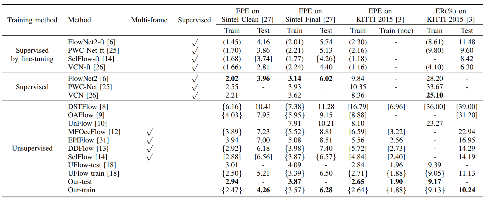

**NccFlow: Unsupervised Learning of Optical Flow With Non-occlusion from Geometry** (IEEE Transactions on Intelligent Transportation Systems 2022)
==============================================================================================================================

This is the official implementation of T-ITS 2022 papaer, "NccFlow: Unsupervised Learning of Optical Flow With Non-occlusion from Geometry" created by Guangming Wang, Shuaiqi Ren and Hesheng Wang.

## Citation
If you find our work useful in your research, please cite:

        @article{wang2021nccflow,
        title={NccFlow: Unsupervised Learning of Optical Flow With Non-occlusion from Geometry},
        author={Wang, Guangming and Ren, Shuaiqi and Wang, Hesheng},
        journal={IEEE Transactions on Intelligent Transportation Systems},
        year={2022}
        }
}

## Abstract
Optical flow estimation is a fundamental problem of computer vision and has many applications in the fields of robot learning and autonomous driving. This paper reveals novel geometric principles of optical flow based on the insight and detailed definition of non-occlusion. Then, two novel loss functions are proposed for the unsupervised learning of optical flow based on the geometric principles of non-occlusion. Specifically, after the occlusion part of the images are masked, the flowing process of pixel coordinate points is carefully considered and geometric constraints are conducted based on the geometric principles of optical flow. First, the optical flow vectors of neighboring pixel coordinate points in the first frame will not intersect during the pixel displacement to the second frame. Secondly, when the cluster containing adjacent four pixel coordinate points in the first frame moves to the second frame. no other pixel coordinate points will flow into the quadrilateral formed by them. According to the two geometrical constraints, the optical flow non-intersection and the optical flow non-blocking loss in the non-occlusion regions are proposed. Two loss functions punish the irregular and inexact optical flows in the non-occlusion regions. The experiments on datasets demonstrated that the proposed unsupervised losses of optical flow based on the geometric principles in non-occlusion regions make the estimated optical flow more refined in detail, and improve the performance of unsupervised learning of optical flow. In addition, the experiments training on synthetic data and evaluating on real data show that the generalization ability of optical flow network is improved by our proposed unsupervised approach.

## Prequisites
    python 3.6.8
    CUDA 10.1
    absl-py>=0.9.0
    gin-config>=0.3.0
    atplotlib>=3.2.1
    numpy>=1.18.3
    opencv-python>=4.2.0.34
    scipy>=1.4.1 
    six>=1.14.0
    imageio>=2.8.0
    tensorboard>=2.1.1
    tensorflow>=2.2.0
    tensorflow-addons>=0.9.1

## Basic Usage

#### Datasets

The datasets supported by this code are [KITTI](http://www.cvlibs.net/datasets/kitti/eval_flow.php) ('kitti'), [Sintel](http://sintel.is.tue.mpg.de/) ('sintel'), [Flying Chairs](http://lmb.informatik.uni-freiburg.de/data/FlyingChairs/FlyingChairs.zip) ('chairs'). For using them, you need to download the datasets and convert them to tfrecord format using the scripts under the data_conversion_scripts folder.

For Flying Chairs, use:

`
python3 -m NccFlow.data_conversion_scripts.convert_flying_chairs_to_tfrecords --data_dir=<path to directory with chairs images and flow> --output_dir=<path to export directory> --shard=0 --num_shards=1
`

For Sintel, use:

`
python3 -m NccFlow.data_conversion_scripts.convert_sintel_to_tfrecords --data_dir=<path to directory with chairs images and flow> --output_dir=<path to export directory> --shard=0 --num_shards=1
`

For KITTI, use:

`
python3 -m NccFlow.data_conversion_scripts.convert_KITTI_multiview_to_tfrecords --data_dir=<path to directory with chairs images and flow> --output_dir=<path to export directory> --shard=0 --num_shards=1
`

### Training
To train the network, run:

`
python3 -m NccFlow.nccflow_main --train_on="<dataset-name>:<path-to-dataset>" --plot_dir=<path-to-plot-dir> --checkpoint_dir=<path-to-checkpoint>
`

### Evaluating
To evaluate the network, run:

`
python3 -m NccFlow.nccflow_evaluator --eval_on="<dataset-name>:<path-to-evaluation-set>" --plot_dir=<path-to-plot-dir> --checkpoint_dir=<path-to-checkpoint>
`

### Experimental Details

if 'sintel' in train_dataset:
  augment_flip_up_down = True
  height = 448
  width = 1024
  weight_smooth1 = 4.0
  weight_smooth2 = 0.0
  occlusion_estimation = 'wang'

if 'chairs' in train_dataset:
  height = 384
  width = 512
  weight_smooth1 = 4.0
  weight_smooth2 = 0.0
  occlusion_estimation = 'wang'

if 'kitti' in train_dataset:
  height = 640
  width = 640
  weight_smooth1 = 0.0
  weight_smooth2 = 2.0
  occlusion_estimation = 'brox'

### Quantitative results:

### Acknowledgments

We thank all the following open-source project for the help of the implementations:
- [uflow](https://github.com/google-research/google-research/tree/master/uflow) (our based network)

